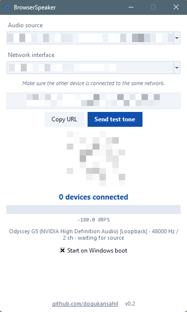
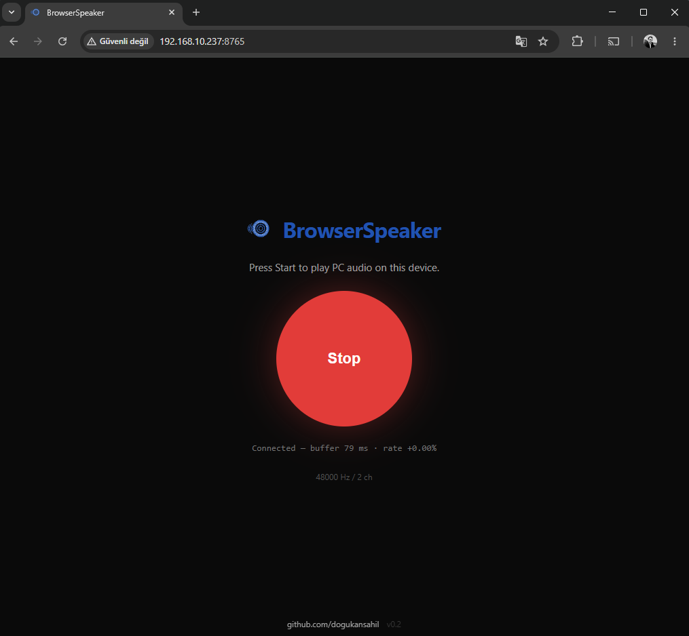

#  BrowserSpeaker

[](https://github.com/dogukansahil/BrowserSpeaker/releases/latest)
[](https://github.com/dogukansahil/BrowserSpeaker/releases/latest)
[](https://github.com/dogukansahil/BrowserSpeaker/releases/latest)
[](https://github.com/dogukansahil/BrowserSpeaker/releases/latest)
[](LICENSE)
[](https://claude.ai)

Turn any phone, tablet, or laptop into a wireless speaker for your **Windows** or **Linux** PC. Anything that has a browser becomes an extra speaker on the same network — **no app to install on the client**.

## How it works

Requires Python 3.10+ to build. End users do not need Python — only the built binary.

The PC captures its own audio output (WASAPI loopback on Windows, PipeWire/PulseAudio monitor on Linux) and streams raw PCM over a local WebSocket. Clients open `http://<your-pc-ip>:8765` in any browser and play it back through Web Audio API.

<div style="display: flex; align-items: center; justify-content: center; gap: 10px; width: 100%;">
  
  
</div>

## Features

- 48 kHz stereo Float32 PCM streaming, ~80 ms end-to-end buffer
- Adaptive playback-rate drift correction (±2 %) — no clicks, no buffer resets
- Per-device source selection (WASAPI loopback on Windows, PipeWire sinks on Linux)
- Per-interface network selection (Ethernet, Wi-Fi, virtual adapters)
- Live RMS / dBFS meter and a built-in test-tone generator
- QR code for one-tap mobile join
- Media Session integration — lock-screen title, artwork, background playback
- Keeps streaming with the screen off — audio continues in the background on most mobile browsers
- Silence keep-alive so the mobile media session never decays when the PC is quiet
- Optional auto-start on boot (Windows registry / Linux XDG autostart)
- Auto-minimize when a client connects, auto-restore on disconnect

## Download

Pre-built binaries are available on the [Releases page](https://github.com/dogukansahil/BrowserSpeaker/releases/latest):

| Platform | File |
|----------|------|
| Windows | `BrowserSpeaker.exe` |
| Linux (Debian/Ubuntu, amd64) | `browserspeaker_1.0_amd64.deb` |

Install on Linux:
```
sudo apt install ./browserspeaker_1.0_amd64.deb
```

## Build it yourself

> **Don't want to build?** Grab a pre-built binary from the [Releases page](https://github.com/dogukansahil/BrowserSpeaker/releases/latest) instead.

If you prefer to compile yourself:

On Windows:

```
git clone https://github.com/dogukansahil/browserspeaker
cd browserspeaker
python -m venv .venv
.venv\Scripts\pip install -r requirements.txt
python build.py
```

The result is `dist\BrowserSpeaker.exe` (~40 MB), fully self-contained.

On Linux (Debian/Ubuntu):

```
git clone https://github.com/dogukansahil/browserspeaker
cd browserspeaker
python3 -m venv .venv
.venv/bin/pip install -r requirements.txt
python3 build_linux.py --deb
```

The build script automatically installs `python3-tk` if missing (via a graphical sudo prompt).
The result is `dist/browserspeaker_1.0_amd64.deb`. Install it with:

```
sudo apt install ./dist/browserspeaker_1.0_amd64.deb
```

> This path assumes you just built it yourself. If you downloaded from the Releases page, run `sudo apt install ./browserspeaker_1.0_amd64.deb` from your download folder instead.

For AppImage instead of .deb:

```
python3 build_linux.py --appimage
```

The Linux build captures system audio via PipeWire (`pw-record`) with a fallback to PulseAudio monitor sources through `sounddevice`.

## Run from source

On Windows:
```
.venv\Scripts\python server.py
```

On Linux:
```
.venv/bin/python server.py
```

## On the client

Open the URL the PC window shows, or scan the QR. Tap **Start**. Make sure both devices are on the same network.

## Roadmap

Ideas that may or may not happen:

- Multiple senders (stream from more than one PC simultaneously)
- Multiple named receivers (select which browser plays which source)

## Notes

- Windows Defender occasionally flags PyInstaller one-file executables as a false positive. If it eats the exe, add the folder to Defender exclusions or build it yourself and trust your own binary.
- For lowest latency, prefer 5 GHz Wi-Fi or Ethernet over 2.4 GHz.

## Disclaimer

This software is provided **as is**, without warranty of any kind, express or implied. It is open source — you are expected to read it, build it, and run it on your own machine, under your own responsibility. The author is not liable for any data loss, audio routing mishaps, network exposure, antivirus false positives, hearing damage from accidentally maxed-out volume, or any other unintended consequence. By running this code you accept full responsibility for it.

## License

Licensed under the **Apache License, Version 2.0**. See [LICENSE](LICENSE) for the full text and [NOTICE](NOTICE.md) for third-party attributions.

---

[github.com/dogukansahil](https://github.com/dogukansahil/)
